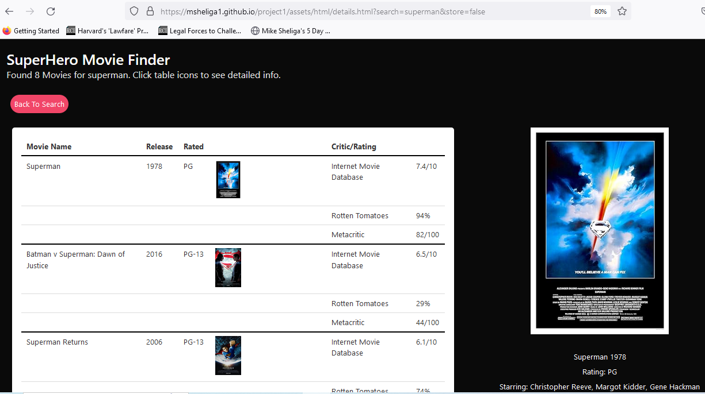

# uriProject1 Multiple API Super Hero Movies   
URI Project I - Multiple APIs, Multiple HTML pages, non-bootstrap CSS framework and local storage - Due 1.9.24
Michael Sheliga, De'Sean Pair and Tayler Baldwin - Started Tuesday 12.19.23

This group repo is for the University of Richmond (URI) coding bootcamp.  
This is the week 7-8 mini-project due 1.9.24. 

## Link to Repo and Deployed Webpage
Link to GitHub Repo: https://github.com/msheliga1/uriProject1MultiAPISuperHeroMovies 
Link to deployed github.io site. https://msheliga1.github.io/uriProject1MultiAPISuperHeroMovies/   
Link to screenshot of deployed github.io site.    
Link to screenshot of 2.    

## Project Goals  
This repo uses multiple APIs, multiple HTML pages (possibly virtual, likely page swapped), local storage and a non-BootStrap CSS framework, 
to create a "Superhero" movie application. The user will type a superhero name, the comicvine API will be used to get a list of movies, 
and the omdb API will be used to get details for each movie.   

## Group Details - Communication, Members and Member Areas
-------------------------------------------------------------
Slack - group-5-project-1 channel
Communication should be done in Slack, unless an urgent need requires email or phone. 
Slack allows a single central point for communication.
Mike Sheliga - MJS - msheliga1 "at" gmail.com - Generally jQuery, Javascript
De'Sean Pair - gitHub dpair12 - generally HTML, modals
Tayler Baldwin - gitHub justmoonflower - generally CSS, Bulma Framework

==============================================================================================================================
## Technical Project Details 
==============================================================================================================================
## Github:  
    Create Repo (github, repositories => New)  
        - Make this a shared repo. 
    Copy directories and sample files from prior project (or create from scratch). 
        -- No starter code. No need for copying one file at a time via command line. Worked well.
        -- Alternate: Go to Demo (root) folder, download zip, moving to local repo, unzip - likely fastest method.     
        -- Could not find a better way to copy over all files.    
        -- OR ... create HTML, CSS and javascript, etc. from scratch or sample files ...  
    Branches  
        - Should do all work in branches. (new branch inside gitHub)  
        - All branch names will begin with the initials of the main person working on the branch.  
        - Must update local repo after adding a branch  
        - Switch to branch: From cmd line git switch <branchname>  
        - Once changes committed, git push origin <branchname>  
            - for pushing to remote test branch: git push origin local_branch:test
        - Issue a pull request in gitHub.
        - Click "Pull Requests" in top menu bar (3rd from left).
        - Click "review Required" in small font below pull request name.
        - and you may approve your own request.  
    Clone to local machine (Copy https, then git clone paste).    
    Create a nice long READ.md file!!  (Modify prior projects.)   
    Commit and push files back to gitHub branch. Issue pull request and approve. 
    Deploy code (Settings...CodeAndAnimation->Pages on left, GitHub Pages->Branch->main, save)
        - Deployed code name always msheliga1/github.io/RepoName !!
    Make Sure it Works  
    Insert Screenshot X2 of deployment into readme file.  
  
## Tools and Technologies Used - HTML, CSS Bulma Framework and JQuery   
    Github - Should use branches
    Create/Modify HTML - De'Sean. Likely 2 separate pages
    Modals (hidden HTML) - De'Sean
    CSS Framwork Bulma - Tayler
    Javascript/JQuery -  Mike
    Agile - Try to assign a little work at a time. 

## Acceptance Criteria  
--------------------
    Use a CSS framework other than Bootstrap.
    Be deployed to GitHub Pages.
    Be interactive (in other words, accept and respond to user input).
    Use at least two server-side APIs
    Links to an external site..
    Use modals instead of alerts, confirms, or prompts.
    Use client-side storage to store persistent data.
    Be responsive.
    Have a polished UI.
    Have a clean repository that meets quality coding standards (file structure, naming conventions, best practices for class/id naming conventions, indentation, quality comments, and so on).
    Have a quality README (including a unique name, description, technologies used, screenshot, and link to the deployed application).

Presentation Requirements

    Use this Project Presentation Template
    Links to an external site. to address the following:
    Elevator pitch: A one-minute description of your application.
    Concept: What is your user story? What was your motivation for development?
    Process: What were the technologies used? How were tasks and roles broken down and assigned? What challenges did you encounter? What were your successes?
    Demo: Show your stuff!

